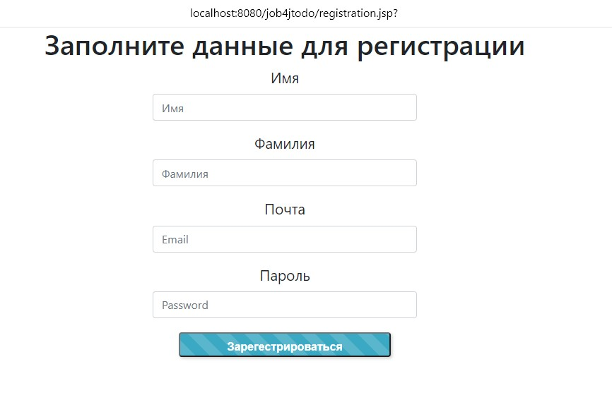
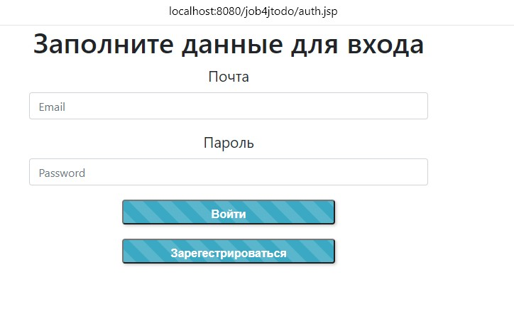
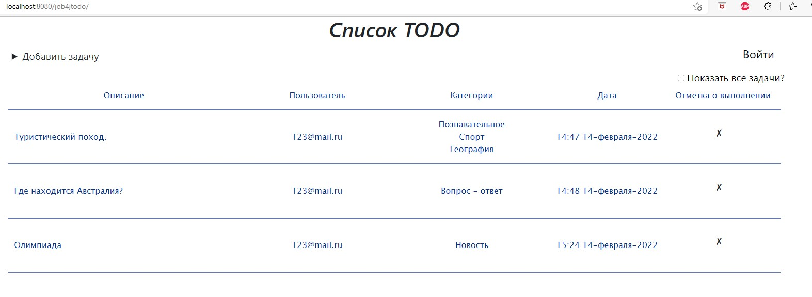

# job4j_todo
 <strong>Учебное приложение</strong>: 'TODO список'.
 <strong>Функционал</strong>:  Приложение представляет собой список задач с описанием, датой создания и отметкой о выполнении.
В приложении есть возможность добавлять задачи, изменять их статус,  а также фильтровать в зависимости от статуса.
 <strong>В приложении используются технологии</strong>: JSP, AJAX, HIBERNATE.
 <strong>Визуализация приложения</strong>:

